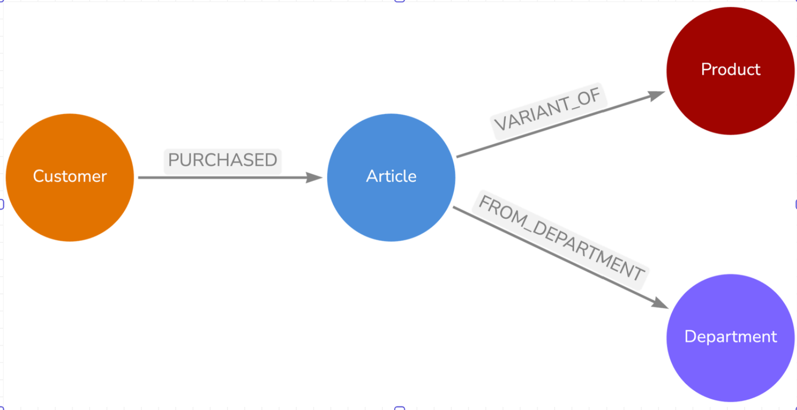
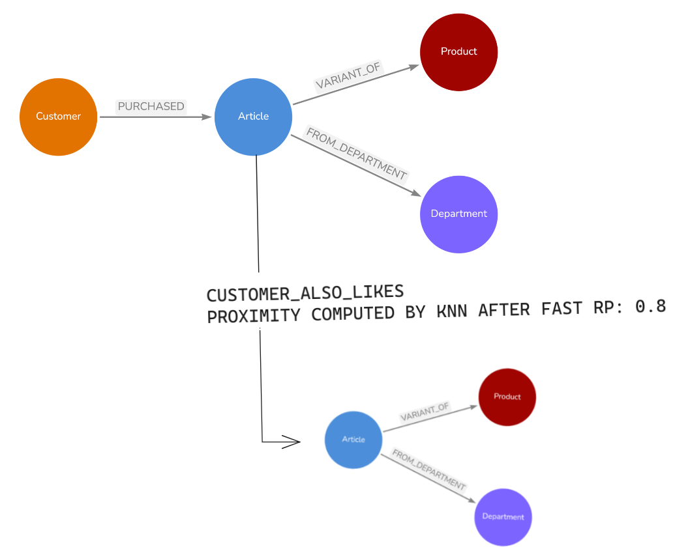
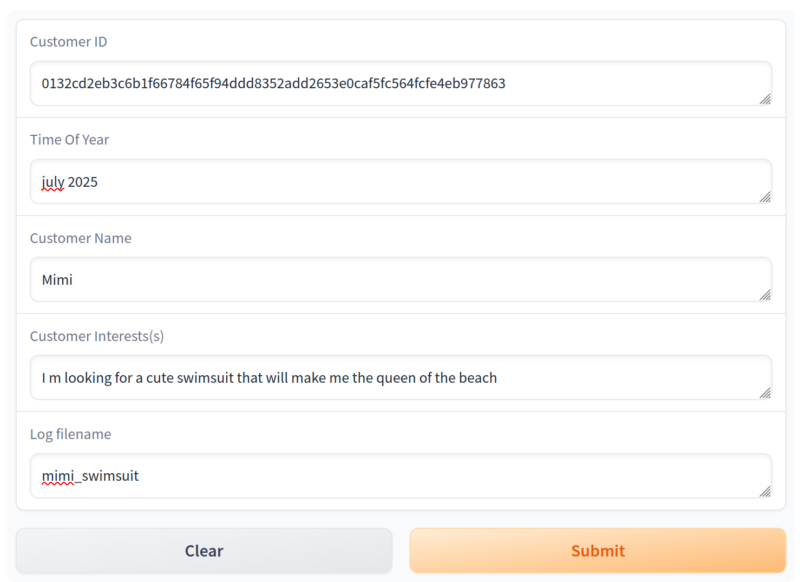
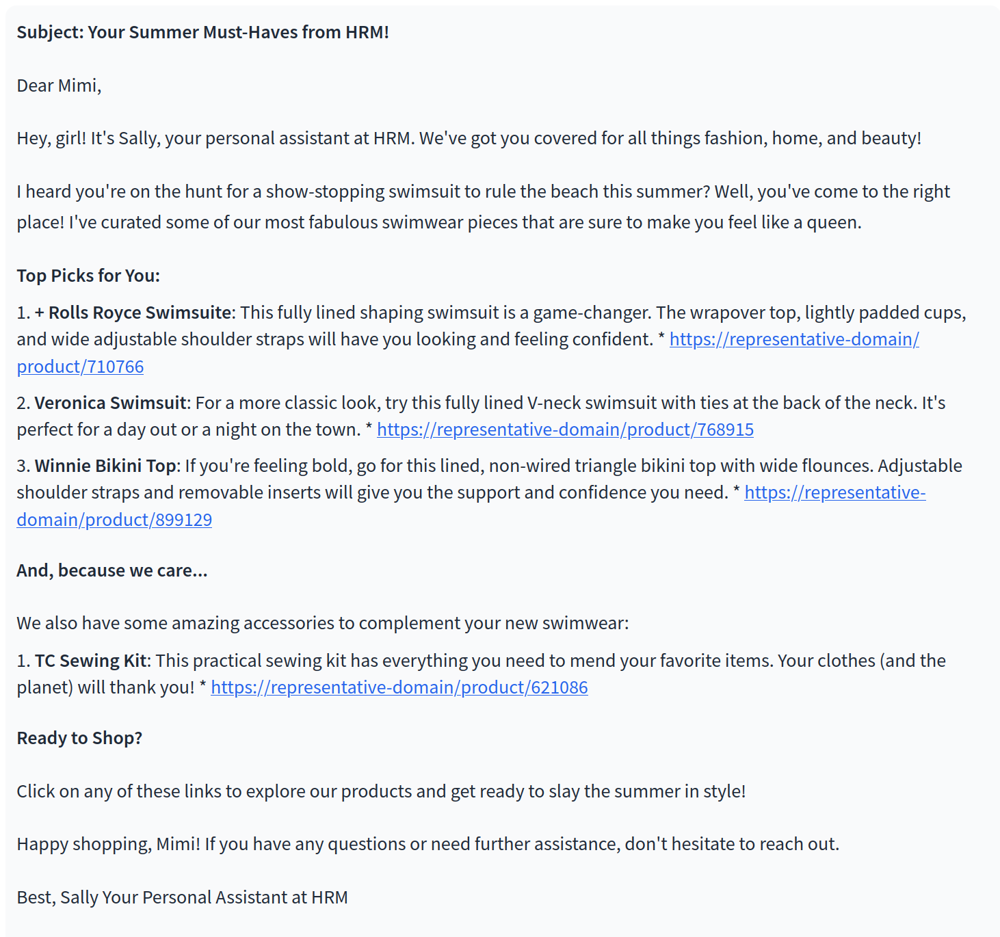
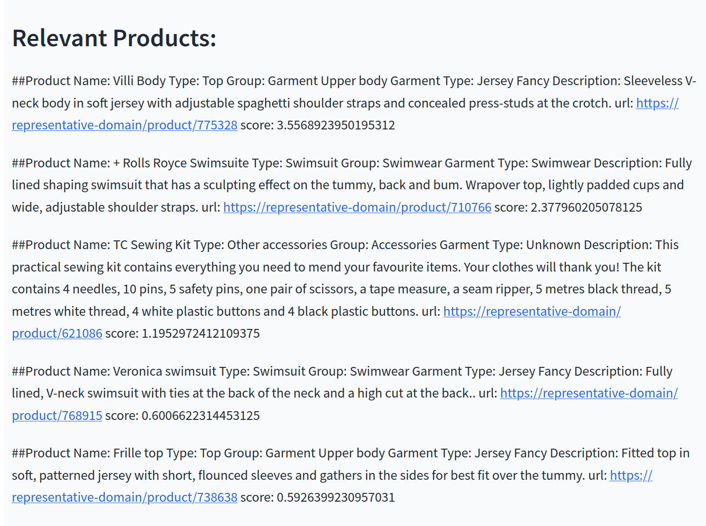

# recommendation_agent_rag
A graph RAG recommendation agent on the H&M Kaggle dataset.  
From a workshop presented by the wonderful team at Neo4j.

## Data Preprocessing
H&M dataset → Neo4j graph database:  

## Recommendation Algorithm
Two queries produce product rankings:
1. **Cosine Similarity**: Based on product description embeddings.
2. **KNN Scores**: Node proximities computed by Fast RP based on graph projection of co-purchased items.  
   

## Stack
- **Database**: Neo4j  
- **Data Preparation**: Pandas  
- **LLM**: Llama 3.1:8B (You can also use your GPT API key—see `database/README` for environment configuration.)  
- **Pipeline and Embeddings**: LangChain  
- **Interface**: Gradio  

## Example

### Input:

### Output:

### Prompt and Scores

- **Relevant Product**:  
  

- **Node Embeddings**:  
  
